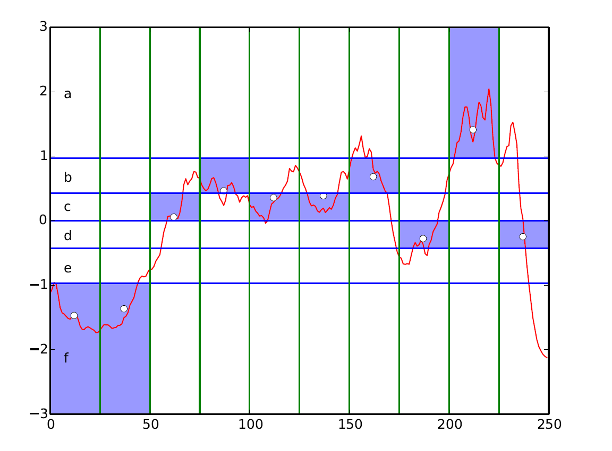

# Time Series Classification with SAX-SEQL

## Description

This page describes the usage of the SAX-SEQL software and supports our publication:

Time Series Classification by Sequence Learning in All-Subsequence Space, ICDE 2017 IEEE International Conference on Data Engineering, San Diego, Thach Le Nguyen, [Severin Gsponer](http://svgsponer.github.io), [Georgiana Ifrim](https://github.com/heerme) (Insight Centre for Data Analytics - University College Dublin)

## SAX



SAX is a transformation method to convert numeric vector to a symbolic representation, i.e. a sequence of symbols from a predefined alphabet *a*. SAX first computes the Piecewise Aggregate Approximation (PAA) of a time series and then transforms this approximation to a symbolic representation. 

PAA reduces a time series of length L to a vector of length *l* (*l* < *L* is also the length of the symbolic sequence) by dividing the time series into equal segments. Each segment is then replaced with its mean value.

PAA followed by a discretisation step which replaces each value of the PAA with a corresponding symbol. Symbol is selected from the alphabet based on the interval in which the value falls. There are *a* intervals, as many as the size of the alphabet. Each interval is associated with a symbol from the alphabet. Assuming that the time series is normal distributed, the intervals are divided under the normal distribution (i.e. *N*(0,1)) with equal probability.


## SEQL

The original SEQL software and its description can be found here: https://github.com/heerme/seql-sequence-learner

## Installation

To compile execute following commands in the src directory:

```
mkdir -p build
cd build
mkdir -p Release
cd Release
cmake -DCMAKE_BUILD_TYPE=Release ../../
make
```


## How to Use


```
./sax_seql -t data/Coffee_TRAIN -T data/Coffee_TEST -d [directory for output] -n 60 -w 16 -a 4
```


